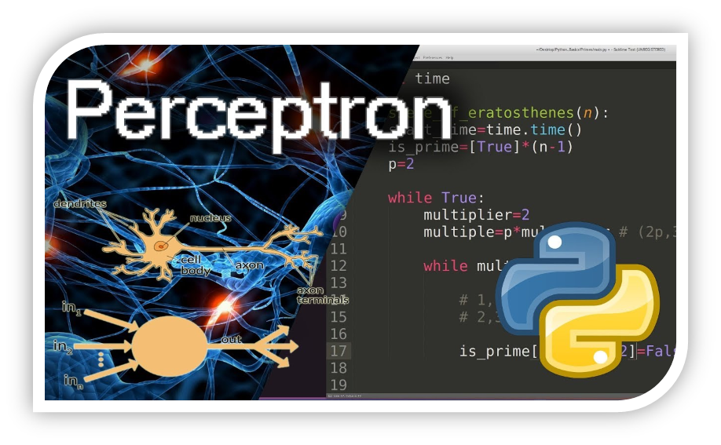

# ***PROCESO DE IMPLEMENTACIÓN DE LA NEURONA ARTIFICIAL BÁSICA: PERCEPTRÓN***

```{r setup1, include=FALSE}

library(kableExtra)
library(knitr)
library(vembedr)
library(flexdashboard)
library(leaflet)

knitr::opts_chunk$set(echo = TRUE)

```

<!-- Se cargan las librerías que utilizaremos para los cálculos (numpy) y para los gráficos (matplotlib) -->

```{python setup2, include=FALSE}

import numpy as np

import matplotlib.pyplot as mplt

```

## ***Se define el perceptrón***

Definiremos la clase del **perceptrón** así como las **funciones de salida y de aprendizaje del perceptrón** según las siguientes fórmulas:

***1. Fórmula de salida del perceptrón***

$$
y = step (\sum_{i} w_i * x_i)
$$

***2. Fórmula de aprendizaje o cálculo de pesos***

$$
w_i = w_i + \alpha * (y_d -y) * x_i
$$ Donde:

$\hspace{1cm}\alpha\hspace{1cm}$ Coeficiente de aprendizaje

$\hspace{1cm}x_i\hspace{1cm}$ Valor de las entradas

$\hspace{1cm}w_i\hspace{1cm}$ Valor de los pesos

## ***Se implementa el perceptrón***

```{python clase, results='hide', collapse=TRUE}

class perceptron:
  
  def __init__(inicio, n): # Damos valores iniciales a los pesos para las n entradas, se inicializa
  
    inicio.pesos = np.random.randn(n) # El número de pesos aleatorios depende del número de entradas n
    
    inicio.n = n # almaceno el n
  
  def salidas(inicio,entradas):
    
    inicio.salidas_r = 1*(inicio.pesos.dot(entradas) > 0) # se realiza el cálculo de la salida según
                                                          # fórmula del punto 1. Producto escalar de
                                                          # pesos por entradas con umbral en 0
    inicio.entradas = entradas
  
  def aprendizaje(inicio, alpha, salidas_deseadas):
    
    for i in range(0, inicio.n): # Se calcularán salidas para el rango de entradas de 0 a n
    
      inicio.pesos[i] = inicio.pesos[i] + alpha*(salidas_deseadas-inicio.salidas_r)*inicio.entradas[i]
      # Cálculo de pesos según fórmula del punto 2

```

## ***Creando un Perceptrón para probar***

#### ***Se crea un Perceptrón como objeto como ejemplo para probar*** {.smaller .build}

```{python Objeto_Perceptron, comment=FALSE}

perceptron_n_entradas = perceptron(5) # Creando un perceptrón de 5 entradas
perceptron_n_entradas.pesos

```

#### ***Se prueban las salidas del perceptrón*** {.smaller .build}

```{python Salidas_Perceptron, comment=FALSE}

perceptron_n_entradas.salidas([1,0,1,1,1])
perceptron_n_entradas.salidas_r

```

#### ***Se prueban las actualizaciones de pesos y salidas del perceptrón mediante aprendizaje*** {.smaller .build}

```{python Aprendizaje_Perceptron, comment=FALSE}

perceptron_n_entradas.aprendizaje(0.5,1) # Cambio el peso y la salida para probar aprendizaje
perceptron_n_entradas.pesos

```

# ***USO DE LA NEURONA ARTIFICIAL BÁSICA: PERCEPTRÓN CON LA FUNCIÓN AND***

## ***Tabla correspondencia Función AND*** {.flexbox .vcenter}

```{r Tabla_AND}

X2 = c(0,0,1,1)
X1 = c(0,1,0,1)
X0 = c(1,1,1,1)
Salida = c(0,0,0,1)

tabla_and = data.frame(X2, X1, X0, Salida)

formato_basico = c("striped", "bordered", "hover", "condensed", "responsive")

knitr::kable(tabla_and, align = "cccc", escape = FALSE, format='html', booktabs = TRUE) %>%
  kable_styling(bootstrap_options = formato_basico, position = "center", font_size = 22) %>%
  row_spec(0, bold = T, color = "white", background = "black")
  
```

## ***Creando el Perceptrón para la función AND con 3 entradas***

```{python Perceptron_AND}

perceptron_AND_3ent_1sal = perceptron(3)

tabla_AND = np.array([[0,0,1,0],[0,1,1,0],[1,0,1,0],[1,1,1,1]])

n = 4

alpha = 0.5

historico_pesos = [perceptron_AND_3ent_1sal.pesos]

repes = 100

for j in range(0,repes):

  for i in range(0,n):
  
    perceptron_AND_3ent_1sal.salidas(tabla_AND[i,0:3])

    perceptron_AND_3ent_1sal.aprendizaje(alpha, tabla_AND[i,3])
  
    historico_pesos = np.concatenate((historico_pesos,[perceptron_AND_3ent_1sal.pesos]), axis=0)
  
```

## ***Graficando las salidas del Perceptrón para la función AND con 3 entradas***

```{python Grafica_Perceptron_AND, fig.align='center', out.width="50%"}

mplt.plot(historico_pesos[:,0],'k')
mplt.plot(historico_pesos[:,1],'r')
mplt.plot(historico_pesos[:,2],'b')
mplt.ylabel('Estabilización Pesos')
mplt.xlabel('Aprendizaje')
mplt.title('Perceptrón Función AND')
mplt.show()

```

# ***CONCLUSIONES***

## ***Las principales conclusiones del trabajo realizado son:***

*1. Se observa en el gráfico resultantes que los pesos tienen un intervalo de estabilización durante las repeticiones que realiza en su aprendizaje hasta que los pesos se estabilizan.*

*2. El perceptrón ha aprendido la función AND.*

# ***Uso de Github***

## ***Creación de Repositorio y acceso:***

```{r Video_Proceso_Github, results='asis'}

embed_url("https://youtu.be/8iajbElxsxs")

```

# ***ACCESOS A COMPARTIR***

## ***Links de Acceso*** {.flexbox .vcenter}

### ***Link de acceso publicación en RPubs:***

{width="15%"}

https://rpubs.com/jachimi/933296

### ***Link de acceso repositorio en Github:***

{width="15%"}
https://github.com/jachimi/proyecto_trabajo_final/tree/master


------------------------------------------------------------------------

<center>***¡¡¡GRACIAS!!!***</center>

{width="100%"}
